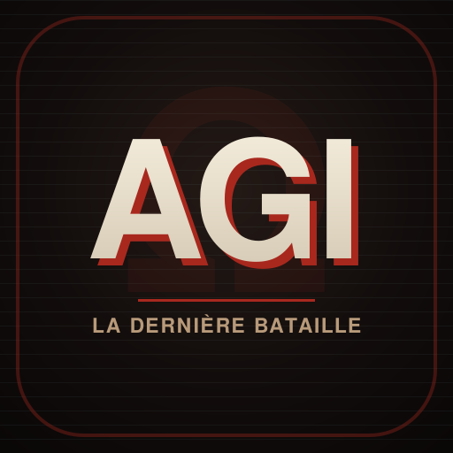

<div align="center">

# AGI — Guerre des Ères

**Le capital contre l'humanité.** Un jeu de stratégie temps réel façon
« age of war », modernisé pour iOS, Android, PC et le web.

**▶ Jouer en ligne : https://dimogdor.github.io/AGI/** *(déployé automatiquement à chaque push)*



</div>

## À propos

Deux camps — l'Humanité et l'IA — s'affrontent sur une seule ligne de front.
Recrutez, bâtissez, tenez les lacs, évoluez à travers les ères jusqu'à la
Transcendance, et survivez à un monde qui se dégrade et déchaîne des
cataclysmes. Solo contre une IA (facile → brutal) ou en **1v1 en ligne**
pair-à-pair (sans serveur).

- 🌐 **Multijoueur 1v1** pair-à-pair (WebRTC, code de salon, zéro backend)
- ⚡ **5 ères + Transcendance**, unités et pouvoirs qui évoluent
- 🌍 **Santé du monde & cataclysmes** (pluie d'acide, canicule, inondation, sable, frappe nucléaire)
- 🌍 **9 langues** : FR, EN, ES, DE, IT, PT, RU, ZH, AR (support RTL)
- 🎮 Tactile, souris et clavier — un seul code pour toutes les plateformes

## Structure du projet

```
guerre-des-eres.html   ← LE JEU (source unique, lisible — éditez ici)
build.mjs              ← build : minifie + obfusque → www/
capacitor.config.json  ← config mobile (iOS/Android + OTA)
electron/              ← app desktop (PC)
tools/                 ← gen-assets (icônes/visuels), gen-screens (captures)
resources/             ← icônes, feature graphic, splash, captures d'écran
www/                   ← bundle généré (git-ignoré, ne pas éditer)
PACKAGING.md           ← guide complet de publication (stores, PC, web, OTA)
STORE-LISTING.md       ← textes & visuels prêts pour les stores
PRIVACY.md             ← politique de confidentialité (URL requise par les stores)
```

## Démarrage rapide

```bash
npm install
npm run build        # génère www/ (code obfusqué)
npm run serve        # aperçu web sur http://localhost:3000
npm run electron     # lance l'app PC
```

Pour développer, ouvrez simplement `guerre-des-eres.html` dans un navigateur.

## Publier

Tout est détaillé dans **[PACKAGING.md](PACKAGING.md)** :

| Cible | Commande | Sortie |
|---|---|---|
| PC | `npm run dist:pc` | installeur Windows/macOS/Linux |
| Android | `npx cap add android && npm run android` | Android Studio → `.aab` |
| iOS (Mac) | `npx cap add ios && npm run ios` | Xcode → App Store |
| Web/PWA | déployer `www/` | site installable, hors-ligne |

Régénérer les visuels : `node tools/gen-assets.mjs` (icônes) et
`node tools/gen-screens.mjs` (captures).

## Mettre à jour le jeu

Modifiez `guerre-des-eres.html` → `npm run build` → republiez. Sur mobile, les
correctifs de contenu (JS/HTML) peuvent partir en **OTA** (sans repasser par les
stores) via le plugin Capgo préconfiguré. Voir PACKAGING.md § « Mises à jour ».

## Mode en ligne — configuration (TURN dédié + liste de salons)

Le 1v1 fonctionne **sans rien configurer** (signalisation PeerJS gratuite + TURN
public de secours). Pour le rendre fiable partout (4G↔4G) et activer la **liste
des parties publiques**, renseigne le bloc `NET_CONFIG` en haut de la section
réseau de `guerre-des-eres.html` :

```js
const NET_CONFIG = {
  firebaseDb:  "https://TON-PROJET-default-rtdb.firebaseio.com", // liste des salons
  cfTurnKeyId: "…",   // Cloudflare TURN — Key ID
  cfTurnToken: "…",   // Cloudflare TURN — API token
};
```

**Cloudflare TURN (relais dédié, gratuit & généreux)**
1. Dashboard Cloudflare → *Realtime* → *TURN* → crée une clé.
2. Copie le **Key ID** et le **API token** dans `cfTurnKeyId` / `cfTurnToken`.
   Les identifiants ICE sont générés à la volée (TTL 24 h, mis en cache). Sans
   ça, repli automatique sur le TURN public OpenRelay.

**Firebase Realtime Database (liste des salons publics)**
1. Crée un projet sur console.firebase.google.com → *Realtime Database* → copie
   l'URL (`firebaseDb`).
2. Règles (lecture/écriture publiques, suffisant pour une liste de salons
   éphémères ; les entrées expirent côté client après 60 s) :
   ```json
   { "rules": { "lobbies": { ".read": true, ".write": true } } }
   ```
   Sans `firebaseDb`, le navigateur de salons affiche « indisponible » et seul le
   jeu par **code (+ mot de passe)** reste actif.

Après modification : `npm run build` puis republie. **Important :** TURN et
`apiKey` Firebase sont par nature exposés côté client (c'est normal pour du
WebRTC/Realtime) ; la sécurité repose sur les règles, pas sur le secret.

## Confidentialité & anti-triche

Le jeu **ne collecte aucune donnée** (voir [PRIVACY.md](PRIVACY.md)). Le build
obfusque le code pour limiter le bidouillage, mais en 1v1 P2P l'hôte reste
maître de la simulation : pour un classement réellement anti-triche, il faudrait
un serveur autoritaire. Détails dans PACKAGING.md.

## Licence

Tous droits réservés © 2026. Voir le propriétaire du dépôt.
